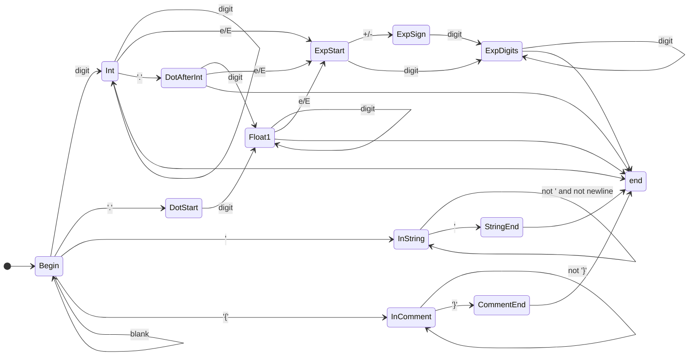
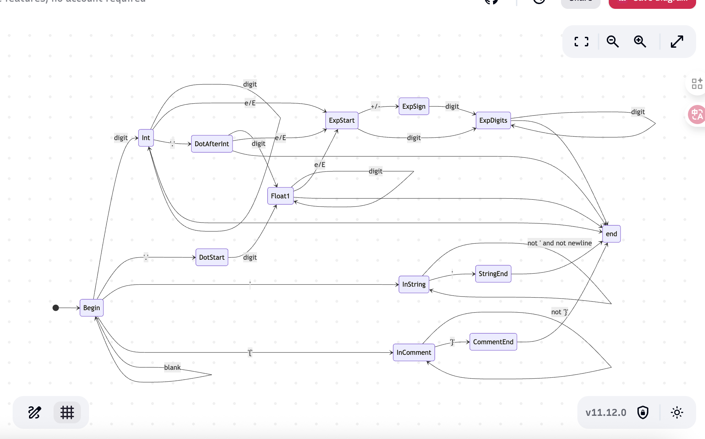

1. Regular expressions
```
DIGIT [0-9]
EXP     [eE][+-]?{DIGIT}+
DEC1    {DIGIT}+\.{DIGIT}*
DEC2    \.{DIGIT}+

comments: \{[^\}]*\} 
strings: '([^\n']*('')?)*' 
integers: {DIGIT}+ 

floating points: ({DEC1}|{DEC2})({EXP})?|{DIGIT}+{EXP} 
```

2. DFA




